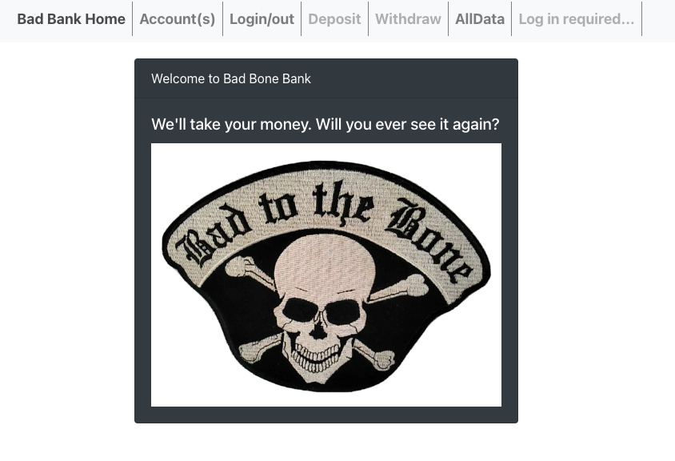

# Bad Bank App

 
 

# About

[Click here to see the Bad Bank App.](https://raina-kpuelsbankingapplication.s3.us-east-2.amazonaws.com/index.html#/alldata/)

This is an exercise developed during MIT xPro Full Stack Professional Certificate in Coding.

I created a React App that houses a very (on ourpose) unsecure banking app. Thank you to t j m code for an excellent template to build off of!
	
# How to Run
Download the files.
From your terminal, <i>npm install</i> and then <npm start>

# Dependencies
React  
Babel  

# Roadmap of Future Improvemenets
This banking app currently only has Front End functionality. The whole back end could be developed.

# Liscence Information 
[MIT License](https://github.com/rainakpuels/Bad-Bank-App/blob/default/LICENSE)

